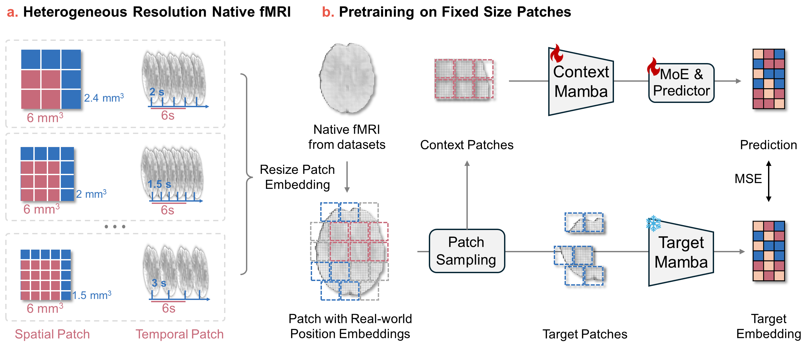

# Flexibrain

Flexibrain is a resolution-agnostic voxel-level framework for native fMRI. It is designed for 4D fMRI collected from different scanners, sites, and protocols, where spatial voxel size and temporal resolution can vary substantially.

Instead of forcing every subject into a fixed template space, Flexibrain defines spatial and temporal patches in real-world physical units, dynamically resizes patch embedding kernels according to each sample's voxel spacing and TR, and learns representations with a Mamba-JEPA backbone.

<p align="center">
  
</p>

## Installation

The code was tested on l40 with Python 3.10, PyTorch 2.1.2, CUDA 12.1, `causal-conv1d`, `mamba-ssm`, and `flash-attn`.

```bash
conda create -n flexibrain python=3.10
conda activate flexibrain
pip install -r requirements.txt
pip install -e .
```

Check the CLI:

```bash
python -m flexibrain --help
python -m flexibrain downstream --help
```

## Data Preparation

### NIfTI Files

Each sample should be a 4D fMRI NIfTI file:

```text
96 x 96 x 96 x T
```

Flexibrain reads voxel size and TR from the NIfTI header. `T_prime` and `tau_seconds` control the selected temporal length:

```text
kt = round(tau_seconds / TR)
T_selected = T_prime * kt
```

### Pretraining Lists

Pretraining uses text files with one NIfTI path per line:

```text
/path/to/sub-0001_bold.nii.gz
/path/to/sub-0002_bold.nii.gz
/path/to/sub-0003_bold.nii.gz
```

A typical layout is:

```text
data/
|-- lists/
|   |-- train.txt
|   |-- val.txt
|   `-- test.txt
`-- nifti/
    |-- sub-0001_bold.nii.gz
    |-- sub-0002_bold.nii.gz
    `-- ...
```

### Downstream Labels

Downstream classification uses the same path-list format plus a CSV label table. The list files contain paths only, not `path,label` pairs.

Default CSV format:

```csv
Subject,Group_idx
003_S_0908,2
011_S_0002,1
1001,0
```

Default label options:

```text
id_column = Subject
label_column = Group_idx
label_mode = multiclass
path_id_mode = auto
```

`path_id_mode=auto` supports common ADNI-style IDs like `003_S_0908`, ADHD-style filenames, and fallback digit IDs. Override it with `--path-id-mode adni`, `--path-id-mode adhd`, or `--path-id-mode digits` when needed.

## Pretraining

Run self-supervised Mamba-JEPA pretraining:

```bash
python -m flexibrain pretrain \
  --train-list /path/to/train.txt \
  --val-list /path/to/val.txt \
  --checkpoint-dir ./checkpoints/mamba_moe1 \
  --log-dir ./logs/mamba_moe1 \
  --embed-dim 512 \
  --depth 24 \
  --predictor-depth 2 \
  --bimamba-type v2 \
  --if-devide-out \
  --batch-size 4 \
  --epochs 30 \
  --lr 5e-4 \
  --weight-decay 0.05 \
  --warmup-epochs 3 \
  --mask-ratio 0.65 \
  --grad-accumulation-steps 4 \
  --t-prime 30 \
  --tau-seconds 6.0
```

Saved outputs:

```text
checkpoints/mamba_moe1/checkpoint_latest.pt
checkpoints/mamba_moe1/checkpoint_best.pt
logs/mamba_moe1/pretrain_*.log
```

## Downstream Classification

A downstream run can be launched with a YAML config:

```bash
python -m flexibrain downstream \
  --config configs/downstream_ppmi.yaml
```

Or with CLI arguments:

```bash
python -m flexibrain downstream \
  --train-list /path/to/train.txt \
  --val-list /path/to/val.txt \
  --test-list /path/to/test.txt \
  --csv /path/to/labels.csv \
  --pretrain-checkpoint /path/to/checkpoint_best.pt \
  --num-classes 3 \
  --head-type transformer \
  --batch-size 8 \
  --epochs 30 \
  --lr 1e-5 \
  --lr-backbone 6e-6 \
  --lr-head 6e-5 \
  --checkpoint-dir ./checkpoints/downstream/ppmi \
  --log-dir ./logs/downstream/ppmi
```

## Config Files

YAML config mirrors the CLI options:

```yaml
pretrain_checkpoint: /path/to/checkpoint_best.pt
from_scratch: false
use_checkpoint_config: true
model:
  model_type: mamba
  num_classes: 3
  head_type: transformer
data:
  train_list: /path/to/train.txt
  val_list: /path/to/val.txt
  test_list: /path/to/test.txt
  csv: /path/to/labels.csv
  batch_size: 8
  T_prime: 30
  tau_seconds: 6.0
training:
  epochs: 30
  lr: 1.0e-5
  lr_backbone: 6.0e-6
  lr_head: 6.0e-5
logging:
  checkpoint_dir: ./checkpoints/downstream/run_name
  log_dir: ./logs/downstream/run_name
```

CLI arguments override values loaded from YAML.
